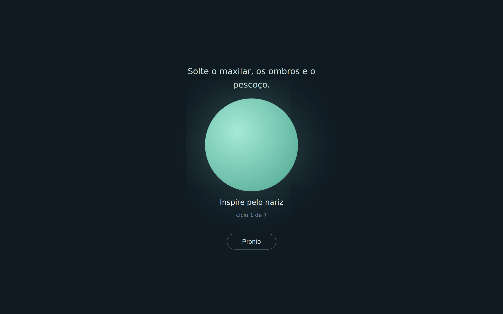

# survive 🌿

**Pausas de respiração para bruxismo em vigília.**

Um lembrete gentil, a cada X minutos, para parar um instante, soltar o maxilar,
os ombros e o pescoço — e respirar num ritmo que ajuda o corpo a desacelerar.

**➡️ Use agora: [joaovbarreto.github.io/survive](https://joaovbarreto.github.io/survive/)**

---

## Por que existe

Quem tem bruxismo em vigília (apertar os dentes durante o dia, sem perceber)
costuma receber a orientação de "se policiar". O problema: ficar checando os
dentes o dia inteiro alimenta a **hipervigilância oclusal** — e pode piorar o
quadro.

Este app segue a orientação de uma especialista em DTM e dor orofacial e faz o
caminho contrário, um princípio de design inegociável aqui:

> **Foco em respiração e relaxamento, nunca em auto-monitoramento dental.**
> O app jamais pergunta sobre os seus dentes. O convite é sempre o mesmo:
> parar um instante, soltar o corpo e respirar.

Por isso também **não há streaks, gráficos nem tracking de dor**. A pausa é um
alívio, não mais uma tarefa.

## Como funciona

1. Defina o intervalo entre pausas — sugestão: 40 a 60 minutos para começar.
   Dá para digitar ou simplesmente rolar o scroll do mouse sobre o número.
   Depois, clique **Iniciar**.
2. Quando chegar a hora, um som suave toca e a aba do navegador fica
   piscando, te chamando — a respiração só começa quando você chega.
3. Siga o círculo por ~7 ciclos (≈70 segundos):
   - **Inspire pelo nariz — 4s** (o círculo expande)
   - **Solte pela boca fazendo biquinho — 6s** (o círculo contrai)
4. Ao final, a tela se fecha sozinha (ou toque **Pronto** para encerrar antes)
   e a contagem recomeça automaticamente.

O intervalo escolhido fica salvo no navegador — não precisa reconfigurar.

### Sobre o ritmo 4s / 6s

Expirar por mais tempo do que se inspira estimula a resposta parassimpática
(tônus vagal), associada ao relaxamento; o biquinho ajuda a controlar e
prolongar a saída do ar. **Não é tratamento nem cura de bruxismo** — é uma
pausa relaxante com embasamento, pensada para conviver melhor com o dia.
Se você tem bruxismo, procure acompanhamento profissional.

## Como usar

- **Online:** abra [joaovbarreto.github.io/survive](https://joaovbarreto.github.io/survive/)
  e deixe a aba aberta enquanto trabalha.
- **Offline:** baixe o `index.html` e abra com um duplo-clique em qualquer
  navegador moderno (Edge, Chrome, Firefox). É um único arquivo, sem instalação,
  sem dependências, sem build.

**Como o app te chama:** som suave + aba piscando (🌿) + notificação do
sistema (se você permitir), que aparece mesmo com o navegador minimizado e
fica na tela até você clicar. A respiração te espera: os ciclos só começam
depois que você abre a aba. A única exigência é o navegador estar aberto em
algum lugar — com ele fechado, nada roda (o modo nativo em segundo plano fica
para uma versão futura).

## Tecnologia

Um único `index.html` com HTML, CSS e JavaScript puros. O som de aviso é
sintetizado na hora via Web Audio API — sem arquivos de áudio.

## Licença

[MIT](LICENSE) — use, estude, modifique e compartilhe à vontade.
